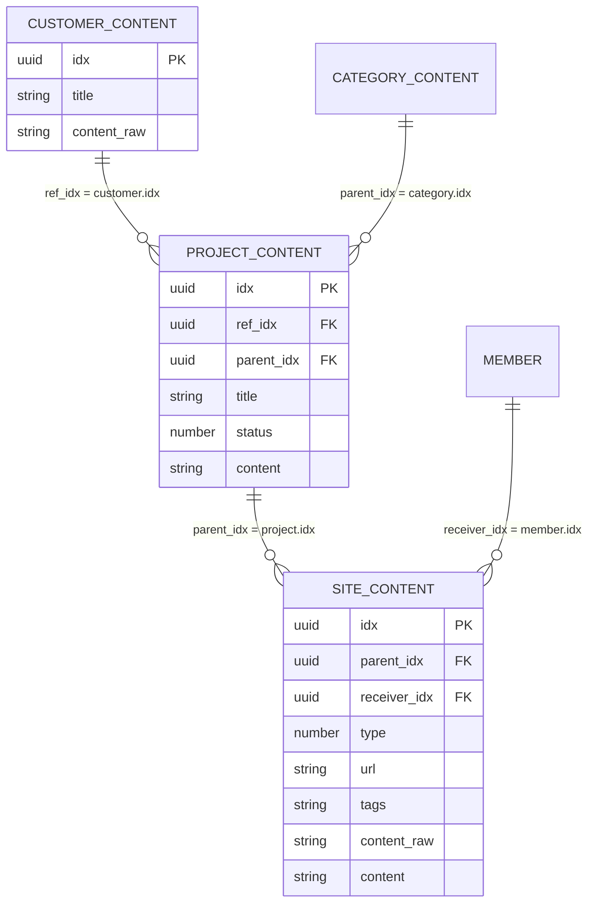

# DoWeb 기존 모듈 기반 구조 — 1차 운영 규격

## 목적

이미 생성된 DoWeb 컨텐츠 모듈을 바꾸지 않고 고객·프로젝트·사이트를 기록하는 운영 규격입니다. 이 문서는 DoWeb API의 `POST /contents`, `PUT /contents`, `GET /contents/list`가 제공하는 필드를 기준으로 합니다.

- 각 데이터는 DoWeb의 **컨텐츠 1건**입니다.
- 컨텐츠의 실제 식별자는 서버가 발급하는 `idx`(UUID 문자열)입니다.
- 아래의 3개 값은 새 DB의 PK가 아니라, 기존 DoWeb **`module_idx`** 입니다.

## 기존 모듈

| 업무 | DoWeb `module_idx` | 컨텐츠 역할 |
|---|---|---|
| 고객 정보 | `01a05700-8c1d-7cd4-8b2d-fac77f865a9f` | 고객사/기관 1건 |
| 프로젝트 정보 | `01a05701-ed99-7cfa-841e-ec6f6c9922a0` | 고객의 서비스/프로젝트 1건 |
| 사이트 정보 | `01a05702-067e-729b-85ab-deb5b0836082` | 프로젝트의 운영 사이트 1건 |

> API 요청에는 각 모듈 ID를 `module_idx`로 넣습니다. 관계에는 각 컨텐츠의 `idx`를 사용합니다.

## DoWeb 관계 ERD



## 1. 고객 컨텐츠

### 기본 필드

| DoWeb 필드 | 값 | 규칙 |
|---|---|---|
| `module_idx` | 고객 정보 모듈 | 고정 |
| `title` | 고객명 | 필수. 고객사/기관의 표시명 |
| `content_raw` | 연락처 JSON | 아래 JSON 규격 |
| `content` | 고객 공통 메모 | 접속 비밀값 금지 |
| `status` | 운영 상태(선택) | 상태값을 쓰면 코드표 별도 확정 |

### `content_raw` 연락처 JSON

```json
{
  "contacts": [
    {
      "type": "phone",
      "name": "이름",
      "contact": "+821000000000"
    }
  ]
}
```

- `contacts`는 배열이며, 연락처마다 객체 `{}` 1개입니다.
- `type`: 우선 `phone`, `email`, `kakao`, `other`만 사용합니다.
- 휴대폰은 E.164 형식(`+82…`)으로 통일합니다.
- `name`이 없으면 빈 문자열 대신 키 자체를 생략할 수 있습니다.

## 2. 프로젝트 컨텐츠

### 기본 필드

| DoWeb 필드 | 값 | 규칙 |
|---|---|---|
| `module_idx` | 프로젝트 정보 모듈 | 고정 |
| `title` | 서비스명/프로젝트명 | 필수 |
| `status` | 운영 상태 | 상태 코드표 확정 필요 |
| `content` | 프로젝트 메모 | 일반 운영 메모 |
| `parent_idx` | 카테고리 컨텐츠 `idx` | 사용자가 지정한 카테고리 관계 |
| `ref_idx` | 고객 컨텐츠 `idx` | 프로젝트의 고객 관계. `parent_idx`가 카테고리에 이미 쓰이므로 고객 연결에 사용 |

### 관계 예시

```text
프로젝트 A
- parent_idx = "카테고리 컨텐츠 idx"
- ref_idx    = "고객 컨텐츠 idx"
```

`parent_idx`와 `ref_idx`는 서로 다른 목적입니다. 이 규칙을 지키면 카테고리와 고객 관계를 동시에 잃지 않습니다.

## 3. 사이트 컨텐츠

### 기본 필드

| DoWeb 필드 | 값 | 규칙 |
|---|---|---|
| `module_idx` | 사이트 정보 모듈 | 고정 |
| `parent_idx` | 프로젝트 컨텐츠 `idx` | 사이트의 소속 프로젝트 |
| `type` | 서비스 구분 | 아래 코드표 사용 |
| `url` | 도메인·호스팅 주소 | 쉼표로 복수 주소 허용 |
| `tags` | 도메인/호스팅사 태그 | 공백으로 태그 구분 |
| `content_raw` | 계정 JSON | 비밀값 원문 저장 금지 |
| `content` | 검수 메모·비고 | 일반 메모 |
| `receiver_idx` | 담당 `members.idx` | member 등록 선행 |

### 사이트 `type` 1차 코드표

| 코드 | 의미 |
|---:|---|
| `1` | 홈페이지/랜딩 |
| `2` | 쇼핑몰 |
| `3` | CMS/관리자 중심 사이트 |
| `4` | API/서비스 서버 |
| `9` | 기타/확인 필요 |

> 기존 값이 있으면 우선 보존하고, 이 표와 다른 값은 이관 검수 목록으로 분리합니다.

### `url` 규칙

사용자 요구대로 쉼표로 여러 주소를 저장합니다.

```text
https://example.com,https://hosting.example.net,https://example.com/admin
```

- 쉼표 뒤 공백은 저장 전 제거합니다.
- 순서는 **공개 도메인 → 호스팅/서버 → 관리자 URL**로 고정합니다.
- URL이 255자를 초과하거나 쉼표 안에 역할이 불명확하면 향후 정규화 구조의 `site_endpoints`로 분리할 대상입니다.

### `tags` 규칙

DoWeb `tags`는 공백으로 구분하므로, 태그 안에 공백을 넣지 않습니다.

```text
domain_https://registrar.example hosting_iwinv
```

| 접두어 | 의미 | 예 |
|---|---|---|
| `domain_` | 도메인 등록업체 주소/식별값 | `domain_https://registrar.example` |
| `hosting_` | 호스팅사 식별값 | `hosting_iwinv` |

### `content_raw` 계정 JSON

사용자가 제시한 형식을 DoWeb `content_raw` 문자열에 저장할 수 있습니다. 단, DoWeb API 명세상 `content_raw`는 비밀값 전용 vault가 아니므로 **`pw`에 실제 비밀번호를 넣지 않습니다.**

```json
{
  "accounts": [
    {
      "type": "SSH",
      "auth": "password",
      "id": "stored-in-restricted-record",
      "secret_ref": "secret://site-access/opaque-reference"
    }
  ]
}
```

| 키 | 의미 |
|---|---|
| `type` | `SSH`, `SFTP`, `FTP`, `CMS`, `DB` |
| `auth` | `password`, `ssh_key`, `token`, `oauth` |
| `id` | 접속 아이디. 일반 사용자 조회 화면에는 마스킹 |
| `secret_ref` | 비밀번호/키/토큰이 있는 제한 저장소 참조 |

기존 클라이언트가 반드시 `pw` 키를 요구한다면 아래처럼 **빈 문자열만** 허용하고 실제 값은 `secret_ref`에서 읽습니다.

```json
{
  "accounts": [
    {
      "type": "SSH",
      "auth": "password",
      "id": "stored-in-restricted-record",
      "pw": "",
      "secret_ref": "secret://site-access/opaque-reference"
    }
  ]
}
```

## 생성 순서

1. `members`에서 작업자 계정을 먼저 등록한다.
2. 고객 컨텐츠를 생성하고 반환된 `customer.idx`를 확보한다.
3. 카테고리 컨텐츠를 조회/생성하고 `category.idx`를 확보한다.
4. 프로젝트 컨텐츠를 생성한다.
   - `parent_idx = category.idx`
   - `ref_idx = customer.idx`
5. 사이트 컨텐츠를 생성한다.
   - `parent_idx = project.idx`
   - `receiver_idx = member.idx`
6. 비공개 제한 저장소에 접속 비밀값을 등록하고 `secret_ref`만 `content_raw`에 기록한다.

## 조회 규칙

| 목적 | DoWeb 목록 조회 기준 |
|---|---|
| 특정 고객의 프로젝트 | 프로젝트 모듈 + `ref_idx = customer.idx` |
| 특정 카테고리의 프로젝트 | 프로젝트 모듈 + `parent_idx = category.idx` |
| 특정 프로젝트의 사이트 | 사이트 모듈 + `parent_idx = project.idx` |
| 담당자별 사이트 | 사이트 모듈 + `receiver_idx = member.idx` |
| 호스팅사별 사이트 | 사이트 모듈 + `tags` 검색 |

## 이 구조의 한계와 정규화 전환 기준

DoWeb 컨텐츠 규격은 빠른 운영 기록에는 적합하지만, 아래 요구가 생기면 이상적인 정규화 구조로 전환합니다.

- 연락처, URL, 계정이 여러 개인 데이터를 조건 검색/정렬해야 할 때
- 고객-프로젝트 또는 프로젝트-사이트가 다대다 관계가 될 때
- 공급자별 계약/만료일/비용을 별도로 관리할 때
- 계정 교체 이력, 권한, 접속 검증 이력을 추적해야 할 때
- URL 목록이 길거나 주소별 역할을 엄격히 구분해야 할 때

정규화 목표 ERD는 [이상적인 정규화 구조](erd-1st-review.md)를 참조합니다.
