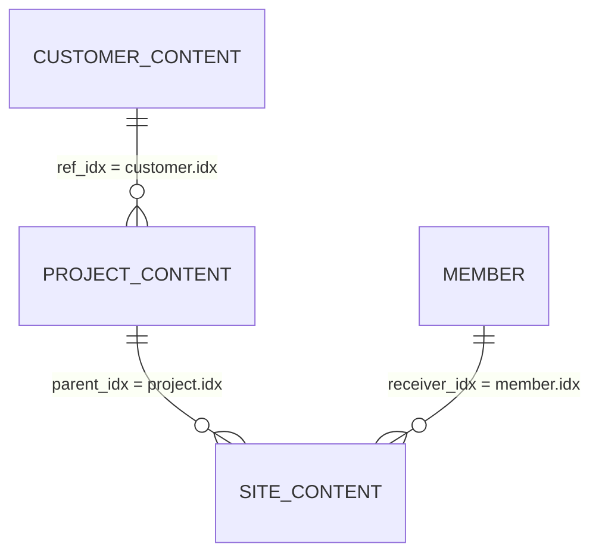

# DoWeb 기존 모듈 기반 구조 — 운영 규격

## 목적

생성되어 있는 DoWeb 컨텐츠 모듈을 바꾸지 않고 유지보수 고객·프로젝트·사이트를 운영하는 규격입니다. 각 데이터는 DoWeb 컨텐츠 1건이고 실제 식별자는 서버가 발급한 `idx` UUID 문자열입니다.

| 업무 | `module_idx` | 컨텐츠 역할 |
|---|---|---|
| 고객 정보 | `01a05700-8c1d-7cd4-8b2d-fac77f865a9f` | 고객사/기관 1건 |
| 프로젝트 정보 | `01a05701-ed99-7cfa-841e-ec6f6c9922a0` | 고객의 유지보수/서비스 단위 1건 |
| 사이트 정보 | `01a05702-067e-729b-85ab-deb5b0836082` | 프로젝트에 속한 운영·개발·스테이징 사이트 1건 |

`module_idx`는 API 요청에만 넣습니다. `parent_idx`, `ref_idx`, `receiver_idx`에는 생성 후 반환된 각 컨텐츠의 `idx`를 사용합니다.

## 관계



- 프로젝트의 고객 관계: `ref_idx = customer.idx`
- 사이트의 프로젝트 관계: `parent_idx = project.idx`
- 사이트 담당자: `receiver_idx = member.idx`
- **`CATEGORY_CONTENT`는 사용하지 않습니다.** 기존 문서의 예시용 카테고리 컨텐츠는 실제 고객도 아니고 현재 모듈 운영 규칙에도 없습니다. 프로젝트 분류는 `tags`로 처리합니다.

## 1. 고객 컨텐츠

| 필드 | 값 | 규칙 |
|---|---|---|
| `module_idx` | 고객 정보 모듈 | 고정 |
| `title` | 고객명 | 필수 |
| `content_raw` | 연락처 JSON | 아래 규격 |
| `content` | 고객 공통 메모 | 검색용 분류나 비밀값을 넣지 않음 |
| `status` | 고객 운영 상태 | 코드표 확정 후 사용 |

### `content_raw` 연락처 JSON

`content_raw`는 API에서 문자열로 받으므로 유효 JSON을 직렬화합니다.

```json
{
  "contact": [
    {
      "type": "phone",
      "name": "이름",
      "contact": "+821000000000"
    }
  ]
}
```

- `contact`는 배열이고, 배열 원소는 각각 객체입니다.
- `type`: `phone`, `email`, `kakao`, `other`.
- 전화는 E.164 형식(`+82…`)으로 저장합니다.
- 검색·대표 지정·비활성화는 정규화 DB의 `customer_contacts`에서 처리합니다.

## 2. 프로젝트 컨텐츠

| 필드 | 값 | 규칙 |
|---|---|---|
| `module_idx` | 프로젝트 정보 모듈 | 고정 |
| `title` | 서비스명/프로젝트명 | 필수 |
| `ref_idx` | 고객 컨텐츠 `idx` | 필수. 프로젝트 소유 고객 |
| `tags` | 프로젝트 분류 태그 | 공백 구분 문자열 |
| `status` | 프로젝트 운영 상태 | 상태 코드표 확정 후 사용 |
| `content` | 프로젝트 메모 | 검색용 분류를 중복 저장하지 않음 |

### 프로젝트 `tags`

카테고리는 별도 컨텐츠나 `content_raw`가 아니라 프로젝트 `tags`에 둡니다. 태그는 JSON이 아닌 **공백 구분 문자열**입니다.

```text
category_maintenance category_cms
```

- 한 태그는 공백 없이 `접두어_값` 형식으로 만듭니다.
- 같은 의미는 같은 태그만 씁니다. 예: `category_maintenance`와 `maintenance`를 혼용하지 않습니다.
- 카테고리 검색은 `tags`에 정확한 태그를 넣어 검색합니다.

## 3. 사이트 컨텐츠

| 필드 | 값 | 규칙 |
|---|---|---|
| `module_idx` | 사이트 정보 모듈 | 고정 |
| `parent_idx` | 프로젝트 컨텐츠 `idx` | 필수. 소속 프로젝트 |
| `type` | 운영 환경 | `production`, `development`, `staging`, `other` |
| `url` | 주소 | 공개 → 호스팅/서버 → 관리자 URL 순서로 쉼표 구분 |
| `tags` | 검색용 기술·운영 분류 | 공백 구분 문자열 |
| `content_raw` | 비검색 구조화 보조정보·비밀 참조 | 실제 비밀값 금지 |
| `content` | 검수 메모·비고 | 일반 메모 |
| `receiver_idx` | 담당 `members.idx` | 담당자 등록 선행 |

### 사이트 `tags`

도메인·호스팅·프레임워크·서버 역할처럼 **검색·조합 검색할 정보**는 사이트 `tags`에 넣습니다.

```text
hosting_iwinv domain_iwinv frame_xe server_web
```

| 접두어 | 예 | 용도 |
|---|---|---|
| `hosting_` | `hosting_iwinv` | 호스팅/클라우드 사업자 |
| `domain_` | `domain_iwinv` | 도메인 등록업체 |
| `frame_` | `frame_xe` | 프레임워크/CMS |
| `server_` | `server_web` | 서버 역할 |

`type`은 사이트의 운영 환경만 표현합니다. 홈페이지·쇼핑몰 같은 서비스 성격까지 필요하면 `service_website`, `service_shop` 태그를 추가합니다.

### 사이트 `content_raw`

`content_raw`에는 목록 검색·필터에 쓰지 않는 구조화 보조정보와 `secret_ref` 같은 제한 저장소 참조만 둡니다. API가 제공하는 `content_raw`는 Secret Vault가 아니므로 암호문을 포함해 비밀번호·토큰·개인키 원문을 넣지 않습니다.

```json
{
  "accounts": [
    {
      "type": "SFTP",
      "auth": "ssh_key",
      "id": "masked-or-restricted-record",
      "secret_ref": "secret://site-access/opaque-reference"
    }
  ]
}
```

## 생성 순서

1. `members`의 작업자 계정을 확인합니다.
2. 고객 컨텐츠를 생성하고 `customer.idx`를 확보합니다.
3. 프로젝트 컨텐츠를 생성합니다: `ref_idx = customer.idx`, `tags = 프로젝트 분류 태그`.
4. 사이트 컨텐츠를 생성합니다: `parent_idx = project.idx`, `type = 운영 환경`, `tags = 사이트 분류 태그`, `receiver_idx = member.idx`.
5. 실제 접속 비밀값은 제한 저장소에 넣고 `secret_ref`만 사이트 `content_raw`에 저장합니다.

## 조회 규칙

| 목적 | 조회 기준 |
|---|---|
| 특정 고객의 프로젝트 | 프로젝트 모듈 + `ref_idx = customer.idx` |
| 특정 분류 프로젝트 | 프로젝트 모듈 + `tags`의 `category_*` |
| 특정 프로젝트의 사이트 | 사이트 모듈 + `parent_idx = project.idx` |
| 운영 사이트 | 사이트 모듈 + `type = production` |
| iwinv 호스팅 사이트 | 사이트 모듈 + `tags`의 `hosting_iwinv` |
| XE 사이트 | 사이트 모듈 + `tags`의 `frame_xe` |

## 데이터 입력 전 검수

- 고객 `title` 중복 여부와 `content_raw` JSON 유효성
- 프로젝트 `ref_idx`가 실제 고객 컨텐츠인지
- 프로젝트·사이트 `tags`가 공백 구분이고 정의된 접두어를 따르는지
- 사이트 `parent_idx`가 실제 프로젝트 컨텐츠인지, `type`이 운영 환경 코드인지
- 사이트 `receiver_idx`가 실제 member인지
- 계정 JSON에 실제 비밀번호·토큰·개인키가 없고 `secret_ref`만 있는지
