# 이상적 정규화 DB 구조 — 유지보수 운영 기준

> 이 문서는 장기 운영 DB 구조입니다. 현재 DoWeb 모듈에 저장하는 API 규격은 [DoWeb 기존 모듈 기반 구조](doweb-content-structure.md)를 참조합니다.

## 결정 사항

1. 고객은 `customers`, 복수 연락처는 `customer_contacts`로 분리합니다.
2. 프로젝트는 고객에 속하고, **카테고리는 별도 테이블이나 `CATEGORY_CONTENT`로 만들지 않습니다.** 프로젝트 `tags`의 `category_*`로 검색합니다.
3. 사이트는 프로젝트에 속합니다. 사이트의 `site_type`은 `production`, `development`, `staging`, `other` 운영 환경입니다.
4. 호스팅·도메인·프레임워크·서버 역할처럼 검색할 정보는 사이트 `tags`로 관리합니다.
5. `content_raw`는 DoWeb API 호환 JSON 표현이며, DB의 다중값 테이블을 조회 기준으로 합니다.
6. 실제 비밀번호·토큰·개인키는 일반 DB와 `content_raw`에 저장하지 않고 `secret_ref`로 제한 저장소만 참조합니다.

## ERD

```mermaid
erDiagram
    CUSTOMERS ||--o{ CUSTOMER_CONTACTS : has
    CUSTOMERS ||--o{ PROJECTS : owns
    PROJECTS ||--o{ SITES : contains
    MEMBERS ||--o{ SITES : primary_operator
    SITES ||--o{ SITE_ENDPOINTS : exposes
    PROVIDERS ||--o{ SITE_ENDPOINTS : supplies
    SITES ||--o{ SITE_ACCESS_ACCOUNTS : uses
    SITES ||--o{ SITE_NOTES : records

    CUSTOMERS {
      bigint id PK
      uuid source_content_idx UK
      string name
      string status
    }
    CUSTOMER_CONTACTS {
      bigint id PK
      bigint customer_id FK
      string contact_type
      string contact_value
      boolean is_primary
      boolean is_active
    }
    PROJECTS {
      bigint id PK
      bigint customer_id FK
      string title
      string tags
    }
    SITES {
      bigint id PK
      bigint project_id FK
      string site_type
      string tags
    }
```

## 테이블별 규칙

### Customers / CustomerContacts

| 컬럼 | 규칙 |
|---|---|
| `customers.source_content_idx` | DoWeb 고객 컨텐츠가 있으면 반환된 `idx`를 1:1로 저장 |
| `customer_contacts.contact_type` | `phone`, `email`, `kakao`, `other` |
| `customer_contacts.contact_value` | 필수. 전화는 E.164 권장 |
| `is_primary` | 고객별 활성 연락처 한 건만 허용 |
| `is_active` | 비활성 연락처는 DoWeb `content_raw.contact[]`에서 제외 |

### Projects

| 컬럼 | 규칙 |
|---|---|
| `customer_id` | 필수 고객 FK |
| `tags` | 공백 구분 문자열. 예: `category_maintenance category_cms` |
| `source_content_idx` | DoWeb 프로젝트 컨텐츠 `idx` |

프로젝트 카테고리를 `parent_idx`나 별도 컨텐츠로 저장하지 않습니다. 고객 관계는 DoWeb `ref_idx`, 카테고리 검색은 `tags`입니다.

### Sites

| 컬럼 | 규칙 |
|---|---|
| `project_id` | 필수 프로젝트 FK |
| `site_type` | `production`, `development`, `staging`, `other` |
| `tags` | 예: `hosting_iwinv domain_iwinv frame_xe server_web` |
| `primary_receiver_id` | 담당 작업자 FK |
| `source_content_idx` | DoWeb 사이트 컨텐츠 `idx` |

`site_type`은 운영 환경만 뜻합니다. 서비스 성격이 필요하면 `service_website`, `service_shop` 같은 태그로 표현합니다.

### Endpoints / Providers / Access accounts

- `site_endpoints`: 주소 한 개당 한 행. 역할은 `public_domain`, `hosting_endpoint`, `admin_url`, `staging`, `other`.
- `providers`: 정규화된 공급자 정보. API의 `hosting_*`, `domain_*` 태그와 이관 시 연결할 수 있습니다.
- `site_access_accounts`: 프로토콜·인증방식·로그인 ID·`secret_ref`만 저장합니다. 비밀 원문 컬럼은 만들지 않습니다.

## tags와 content_raw 구분

| 저장 위치 | 넣을 정보 | 예 |
|---|---|---|
| 프로젝트 `tags` | 프로젝트 분류, 검색할 고객 유형 | `category_maintenance` |
| 사이트 `type` | 운영/개발/스테이징 환경 | `production` |
| 사이트 `tags` | 호스팅·도메인·프레임워크·서버 역할 | `hosting_iwinv frame_xe` |
| `content_raw` | 검색하지 않는 구조화 보조정보, 제한 저장소 참조 | `contact[]`, `accounts[].secret_ref` |
| 제한 저장소 | 실제 비밀값 | password/token/private key |

## 이관·검수 순서

1. 고객 및 연락처를 적재하고 유효한 `content_raw.contact[]`를 직렬화합니다.
2. 고객 컨텐츠의 반환 `idx`를 `customers.source_content_idx`에 연결합니다.
3. 프로젝트를 고객에 연결하고, 기존 카테고리는 `category_*` 태그로 변환합니다.
4. 사이트를 프로젝트에 연결하고, 운영/개발 값은 `site_type`에, 호스팅·도메인·프레임워크는 사이트 태그에 넣습니다.
5. URL은 endpoint 행으로 분리하고, 계정은 `secret_ref`만 이관합니다.
6. 고객·프로젝트·사이트 관계, 태그 표기, 비밀값 미포함 여부를 읽기 전용으로 대조한 뒤 승인합니다.
