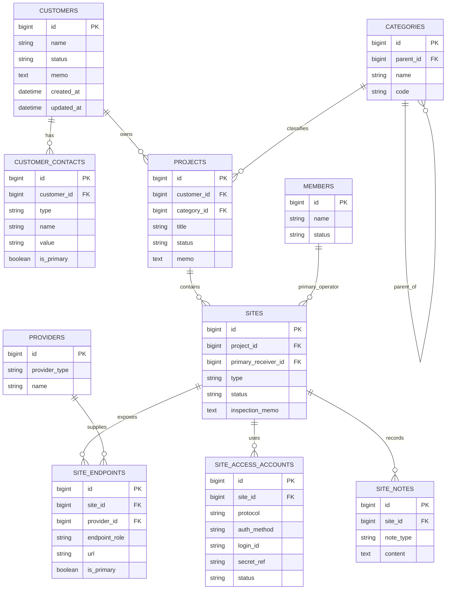

# 이상적 정규화 DB 구조 — 1차 검수

> 이 문서는 **장기 목표 구조**입니다. 이미 생성된 DoWeb 컨텐츠 모듈을 지금 운영하는 저장 규격은 [DoWeb 기존 모듈 기반 구조](doweb-content-structure.md)를 참조합니다.

## 목적

기존 고객 서비스 시트의 반복 값과 다중 값을 분리해, 고객·프로젝트·사이트·도메인·호스팅·담당자·접속계정을 안정적으로 조회하고 유지보수 자동화에 연결합니다.

> **이번 문서는 설계 검수용입니다.** 실제 DB 생성, 서비스 시트 이관, 접속정보 입력은 포함하지 않습니다.

## 결론 요약

| 대상 | 권장 구조 | 이유 |
|---|---|---|
| 고객 연락처 | `customer_contacts` 별도 테이블 | 고객당 복수 담당자·전화·이메일을 검색/수정 가능 |
| 프로젝트 카테고리 | `categories` + `projects.category_id` | `parent_idx` 숫자 의미를 관계로 명확화 |
| 사이트 URL | `site_endpoints` 별도 테이블 | 도메인·호스팅 주소가 여러 개인 경우 쉼표 문자열 제거 |
| 도메인/호스팅사 | `providers` + 관계 테이블 | `tags`의 `domain_`, `hosting_` 문자열을 정규화 |
| 접속 계정 | `site_access_accounts` + Secret Vault 참조 | 계정은 관리하되 비밀번호를 일반 DB/문서에 저장하지 않음 |
| 작업자 | `members` + `sites.primary_receiver_id` | `receiver_idx`를 외래키로 보장 |

## 식별자 정책 — 1차 권장안

**UUID를 모든 테이블에 쓸 필요는 없습니다.** 1차 운영 DB는 각 테이블의 내부 키를 `BIGINT IDENTITY`(자동증가 숫자)로 통일합니다. 외래키도 같은 숫자 키를 참조하므로 ERD에 보이는 ID가 많아도 실제로 새 UUID를 계속 입력하거나 관리할 일은 없습니다.

- 원본 고객/프로젝트/사이트 데이터베이스 ID는 **원본 DB 식별자**일 뿐, 새 테이블 행의 PK로 복사하지 않습니다.
- 나중에 외부 API 공개 ID, 여러 DB 병합, 오프라인 생성·동기화가 필요해질 때만 해당 경계에 `public_id UUID`를 추가합니다.
- 지금 단계에서는 `id BIGINT` + 관계 FK만으로 충분합니다.

## ERD



## 핵심 엔터티

### 1. Customers — 고객

| 컬럼 | 타입 | 필수 | 설명 |
|---|---|---:|---|
| `id` | BIGINT | Y | 내부 식별자 |
| `name` | VARCHAR(200) | Y | 고객사/개인 표시명 |
| `status` | VARCHAR(30) | Y | `active`, `inactive`, `lead`, `archived` 등 |
| `memo` | TEXT | N | 고객 공통 메모. 접속 비밀값 금지 |
| `created_at`, `updated_at` | TIMESTAMPTZ | Y | 감사용 시각 |

### 2. CustomerContacts — 고객 연락처

고객 연락처를 JSON 배열에만 두면 전화번호 검색, 대표 연락처 지정, 연락처별 비활성 처리가 어렵습니다. 정규화 테이블을 기준으로 하고, 기존 플랫폼 호환이 필요할 때만 `content_raw`에 동기화 사본을 둡니다.

| 컬럼 | 타입 | 필수 | 규칙 |
|---|---|---:|---|
| `customer_id` | BIGINT FK | Y | `customers.id` |
| `type` | VARCHAR(30) | Y | `phone`, `email`, `kakao`, `other` |
| `name` | VARCHAR(100) | N | 담당자명 |
| `value` | VARCHAR(320) | Y | 전화는 E.164 형식 권장: `+8210…` |
| `is_primary` | BOOLEAN | Y | 고객별 대표 연락처 1개 권장 |

**제공된 `content_raw` 형식의 보정 예시**

```json
{
  "contacts": [
    {
      "type": "phone",
      "name": "이름",
      "contact": "+821000000000"
    }
  ]
}
```

> 배열의 각 항목은 `{ ... }` 객체여야 유효한 JSON입니다.

### 3. Categories — 프로젝트 카테고리

`parent_idx`는 숫자만으로 의미를 알 수 없으므로 `categories.parent_id` 자기참조 관계로 전환합니다.

| 예시 | parent_id |
|---|---|
| 유지보수 | `NULL` |
| 홈페이지 유지보수 | 유지보수의 `id` |
| 신규 구축 | `NULL` |

### 4. Projects — 프로젝트

| 컬럼 | 타입 | 제공 필드 대응 | 설명 |
|---|---|---|---|
| `customer_id` | BIGINT FK | 신규 관계 | 프로젝트 소유 고객 |
| `category_id` | BIGINT FK | `parent_idx` | 최하위 또는 선택된 카테고리 |
| `title` | VARCHAR(250) | `title` | 서비스/프로젝트명 |
| `status` | VARCHAR(30) | `status` | 운영 상태 |
| `memo` | TEXT | `content` | 프로젝트 메모 |

### 5. Sites — 사이트

프로젝트 하나가 여러 사이트를 가질 수 있으므로 사이트를 독립 엔터티로 둡니다.

| 컬럼 | 타입 | 제공 필드 대응 | 설명 |
|---|---|---|---|
| `project_id` | BIGINT FK | 신규 관계 | 소속 프로젝트 |
| `type` | VARCHAR(50) | `type` | 예: `website`, `shop`, `api`, `server` |
| `status` | VARCHAR(30) | 권장 신규 | 운영/중지/이관/폐기 상태 |
| `primary_receiver_id` | BIGINT FK | `receiver_idx` | 주 담당 작업자 |
| `inspection_memo` | TEXT | `content` | 검수 메모·비고 |

### 6. SiteEndpoints — 사이트 주소

`url`에 쉼표로 여러 주소를 저장하지 않고, 한 주소를 한 행으로 저장합니다.

| 컬럼 | 예시 | 설명 |
|---|---|---|
| `endpoint_role` | `public_domain`, `hosting_endpoint`, `admin_url`, `staging` | 주소 역할 |
| `url` | `https://example.com` | 원본 주소 |
| `provider_id` | 도메인 등록업체/호스팅사 | 공급자 연결 |
| `is_primary` | `true` | 역할별 기본 주소 지정 |

### 7. Providers — 도메인 등록업체·호스팅사

기존 `tags`의 아래 규칙은 이관 시 참고값으로 사용합니다.

```text
domain_[도메인업체주소]
hosting_[호스팅업체]
```

정규화 후에는 `providers`에 공급자를 한 번 등록하고, `site_endpoints.provider_id`로 연결합니다.

| 컬럼 | 예시 |
|---|---|
| `provider_type` | `domain_registrar`, `hosting`, `cloud`, `cdn` |
| `name` | 업체 표시명 |
| `website` | 공급자 웹사이트 |

### 8. SiteAccessAccounts — 운영 접속 계정

계정의 프로토콜·인증방식·아이디는 구조화하되 **비밀번호/토큰/개인키 원문은 일반 DB의 `content_raw`나 Git에 저장하지 않습니다.**

| 컬럼 | 타입 | 설명 |
|---|---|---|
| `site_id` | BIGINT FK | 대상 사이트 |
| `protocol` | VARCHAR(20) | `SSH`, `SFTP`, `FTP`, `CMS`, `DB` |
| `auth_method` | VARCHAR(20) | `password`, `ssh_key`, `oauth`, `token` |
| `login_id` | VARCHAR(255) | 접속 아이디 |
| `secret_ref` | VARCHAR(255) | Secret Vault/비공개 레코드의 참조 ID |
| `status` | VARCHAR(30) | `active`, `disabled`, `rotated` |

**제공된 형식의 안전한 목표 형태**

```json
{
  "accounts": [
    {
      "type": "SSH",
      "auth": "password",
      "id": "stored-in-restricted-record",
      "secret_ref": "secret://site-access/<opaque-id>"
    }
  ]
}
```

`pw` 값은 migration 입력에서만 Secret Vault 또는 현재 제한 레코드로 옮긴 뒤 제거합니다. 문서, Git, Slack, Issue, 일반 DB에는 기록하지 않습니다.

## 관계 및 제약 조건

1. 고객 1명(사/기관) : 프로젝트 N개.
2. 프로젝트 1개 : 사이트 N개.
3. 사이트 1개 : endpoint N개, access account N개, note N개.
4. 카테고리는 자기참조 트리이며 순환 참조 금지.
5. 같은 사이트에서 동일 `endpoint_role`의 primary endpoint는 최대 1개.
6. 같은 고객에서 대표 연락처는 최대 1개 권장.
7. `site_access_accounts.secret_ref`는 필수이며, 비밀값 원문 컬럼은 만들지 않음.
8. 하나의 사이트가 여러 프로젝트에서 공용으로 쓰이는 사례가 확인되면 `project_sites` 조인 테이블로 1:N 구조를 M:N으로 확장.

## 1차 검수에서 결정할 항목

| 질문 | 기본안 | 결정 필요 |
|---|---|---|
| 프로젝트-고객 관계 | 고객 1 : 프로젝트 N | 공동 고객 프로젝트가 있는지 |
| 사이트-프로젝트 관계 | 프로젝트 1 : 사이트 N | 공용/통합 사이트 존재 여부 |
| 연락처 저장 | 별도 테이블 + 필요 시 JSON 동기화 | 기존 시스템이 JSON만 읽는지 |
| 비밀값 저장 | Secret Vault/제한 레코드 참조 | 사용할 vault 또는 제한 레코드 규칙 |
| 상태 코드 | 코드 테이블 또는 enum | 현 운영 상태 목록 확정 |
| provider 관리 | 공통 `providers` 테이블 | 도메인·호스팅 외 CDN/메일까지 포함 여부 |

## 이관 순서 제안

1. `members`, `categories`, `providers` 기준 데이터를 먼저 등록.
2. 고객 → 연락처 → 프로젝트 → 사이트 순서로 서비스 시트 데이터를 적재.
3. 쉼표 URL을 분리해 `site_endpoints` 행으로 변환.
4. `tags`의 `domain_`, `hosting_`을 parse하여 `providers` 관계로 이관.
5. 계정 정보는 `secret_ref`만 생성/연결하고, 비밀값 원문은 제한 저장소로 분리.
6. 기존 값 수·누락·중복·관계 오류를 대조한 뒤 읽기 전용 검수.
7. 검수 승인 후에만 신규 DB를 운영 기준으로 전환.
