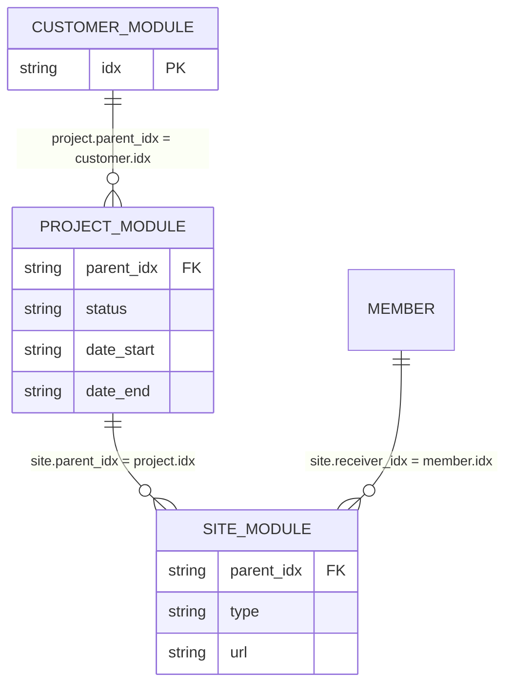

# `wr_content_t` 3모듈 ERD와 필드 구조

고객·프로젝트·사이트는 별도 테이블이 아닌 `module_idx`가 다른 `wr_content_t` 행입니다.



## 공통 필드 사용

| 필드 | 고객 | 프로젝트 | 사이트 |
|---|---|---|---|
| `parent_idx` | — | 고객 `idx` | 프로젝트 `idx` |
| `title` | 고객명 | 서비스명 | 필요 시 표시명 |
| `status` | — | 운영상태 | — |
| `date_start` | — | 개설일 | — |
| `date_end` | — | 종료일 또는 `2999-12-31` | — |
| `type` | — | — | 구분 (개발/운영) |
| `url` | — | — | `도메인주소, 호스팅주소` |
| `tags` | — | 카테고리 | 도메인·호스팅·프레임워크 |
| `receiver_idx` | — | — | 담당 member `idx` |
| `content` | 고객 메모 | 프로젝트 메모 | 검수메모·비고 |

## `content_raw` 기준

공용·관계 필드와 같은 의미의 키를 넣지 않습니다.

| 모듈 | 보존값 |
|---|---|
| 고객 | 고객명 매핑 근거, 담당자 연락처 배열 |
| 프로젝트 | 원본 서비스ID |
| 사이트 | 고객 연락처·이메일 원문, 접속·DB 정보 |

### 프로젝트 예시

```json
{"source":{"service_id":"SVC-201"}}
```

`title`, `status`, `date_start`, `date_end`, `tags`는 공용 필드에 저장합니다.

### 사이트 예시

```json
{
  "source": {"customer_contact":"원본 고객연락처", "customer_email":"원본 고객이메일"},
  "access": {
    "hosting":{"id":"H열","password":"I열"},
    "admin":{"id":"J열","password":"K열"},
    "database":{"url":"L열","id":"M열","password":"N열"}
  }
}
```

사이트의 `type`은 `구분 (개발/운영)`, `url`은 `도메인주소, 호스팅주소` 형식의 공용 필드입니다.

## 적재 순서

1. 고객 행 생성 후 `customer.idx`를 받습니다.
2. 프로젝트 `parent_idx`에 고객 `idx`를 설정하고, `date_end`는 종료일 원본 또는 `2999-12-31`로 설정합니다.
3. 사이트 `parent_idx`에 프로젝트 `idx`를 설정하고 `type`, `url`을 공용 필드에 넣습니다.
4. `content_raw` JSON과 관계값을 검증합니다.
