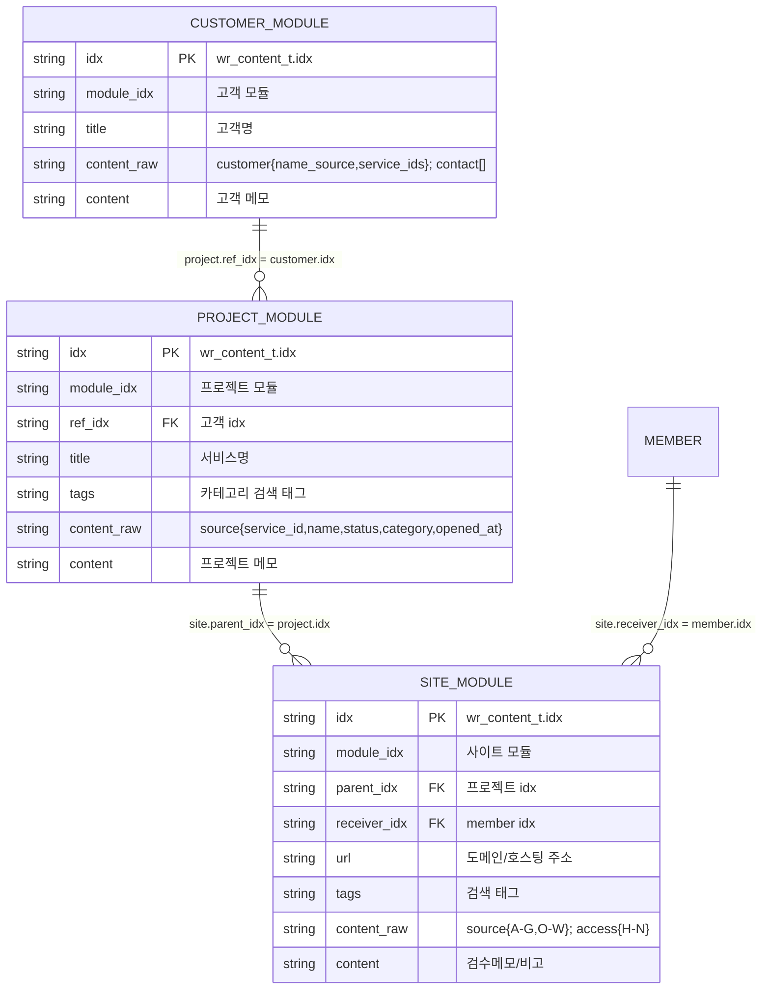
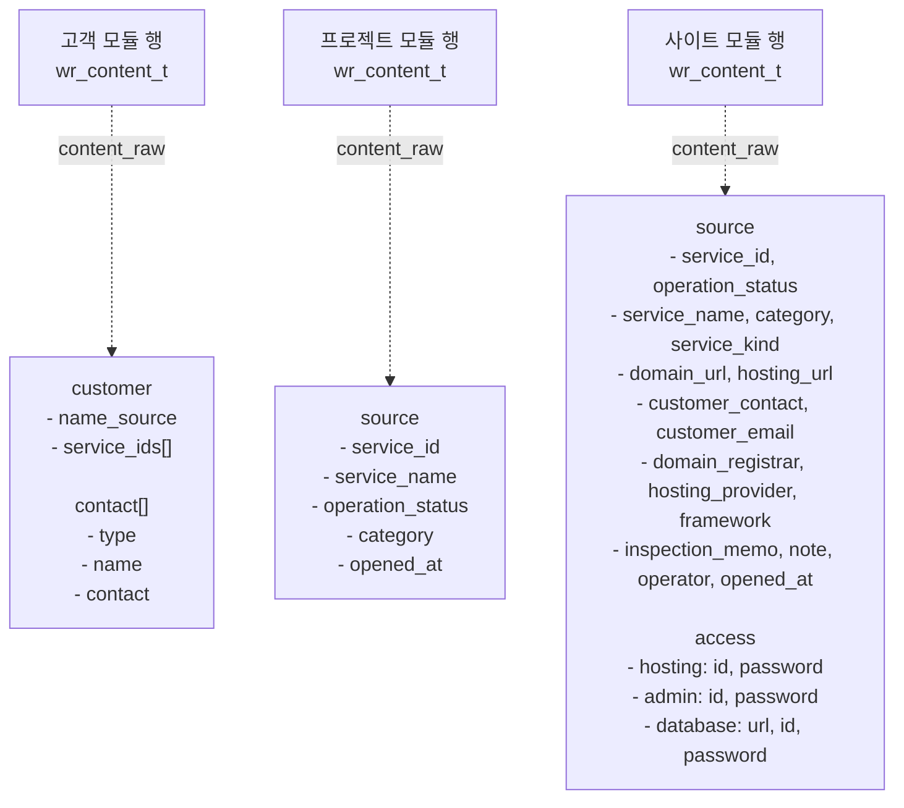

# `wr_content_t` 3모듈 ERD와 필드 구조

## 물리 구조와 논리 모듈

물리 테이블은 `wr_content_t` 하나입니다. 아래 고객·프로젝트·사이트는 ERD 이해를 위한 **논리 별칭**이며 별도 테이블이 아닙니다.



## ERD에서 보는 `content_raw` 구성

아래 상자는 별도 테이블이 아니라 각 모듈 행의 `content_raw` JSON 내부 키를 보여줍니다.



- 고객 `content_raw`: 고객명 근거와 여러 담당자 연락처
- 프로젝트 `content_raw`: 서비스의 기본 식별·분류 이력
- 사이트 `content_raw`: 원본 엑셀 A~W 전체를 `source`와 `access`로 보존

## `wr_content_t` 공통 필드 사용

| 필드 | 고객 모듈 | 프로젝트 모듈 | 사이트 모듈 |
|---|---|---|---|
| `idx` | 고객 행 식별자 | 프로젝트 행 식별자 | 사이트 행 식별자 |
| `module_idx` | 고객 모듈 ID | 프로젝트 모듈 ID | 사이트 모듈 ID |
| `title` | 고객명 | 서비스/프로젝트명 | 필요 시 사이트 표시명 |
| `ref_idx` | — | 고객 `idx` | — |
| `parent_idx` | — | — | 프로젝트 `idx` |
| `receiver_idx` | — | — | 담당 member `idx` |
| `url` | — | — | 도메인주소, 호스팅주소 |
| `tags` | — | 카테고리 | 도메인·호스팅·프레임워크 |
| `content_raw` | 연락처·고객 원본 | 원본 서비스 식별·분류 | 원본 전체 열·접속정보 |
| `content` | 고객 메모 | 프로젝트 메모 | 검수메모·비고 |

## 모듈별 `content_raw` 구조

`content_raw`는 공용 API에 JSON **문자열**로 보냅니다.

### 고객 모듈

```json
{
  "customer": {
    "name_source": "고객명 매핑 기준",
    "service_ids": ["SVC-201"]
  },
  "contact": [
    {
      "type": "phone",
      "name": "담당자명",
      "contact": "+821000000000"
    },
    {
      "type": "email",
      "name": "담당자명",
      "contact": "manager@example.com"
    }
  ]
}
```

### 프로젝트 모듈

```json
{
  "source": {
    "service_id": "SVC-201",
    "service_name": "샘플교회 홈페이지",
    "operation_status": "운영",
    "category": "교회",
    "opened_at": "2024-05-20"
  }
}
```

### 사이트 모듈

사이트 모듈의 `content_raw`가 원본 서비스 시트 A~W의 최종 보존 위치입니다.

```json
{
  "source": {
    "service_id": "SVC-201",
    "operation_status": "운영",
    "service_name": "샘플교회 홈페이지",
    "category": "교회",
    "service_kind": "실제",
    "domain_url": "samplechurch.example.kr",
    "hosting_url": "samplechurch.iwinv.net",
    "customer_contact": "원본 고객연락처",
    "customer_email": "원본 고객이메일",
    "domain_registrar": "가비아",
    "hosting_provider": "iwinv",
    "framework": "XE",
    "inspection_memo": "원본 검수메모",
    "note": "원본 비고",
    "operator": "원본 작업자",
    "opened_at": "2024-05-20"
  },
  "access": {
    "hosting": {"id": "H열", "password": "I열"},
    "admin": {"id": "J열", "password": "K열"},
    "database": {"url": "L열", "id": "M열", "password": "N열"}
  }
}
```

## 한 서비스 행의 최종 행 나열 예시

| 논리 모듈 | `idx` | `ref_idx` | `parent_idx` | `title` | `tags` | `content_raw` |
|---|---|---|---|---|---|---|
| 고객 | `customer-uuid-001` | — | — | 샘플교회 | — | `customer`, `contact[]` |
| 프로젝트 | `project-uuid-001` | `customer-uuid-001` | — | 샘플교회 홈페이지 | `category_church` | `source.service_id` 등 |
| 사이트 | `site-uuid-001` | — | `project-uuid-001` | — | `domain_gabia hosting_iwinv frame_xe` | `source` + `access` (원본 A~W 전체) |

## 적재 순서

1. 고객 모듈 행을 만들고 고객 `idx`를 받습니다.
2. 프로젝트 모듈 행을 만들며 `ref_idx`에 고객 `idx`를 넣습니다.
3. 사이트 모듈 행을 만들며 `parent_idx`에 프로젝트 `idx`를 넣습니다.
4. 각 행의 `content_raw`가 유효한 JSON 문자열인지 확인합니다.
5. 목록 조회에서 세 행의 `module_idx`, `ref_idx`, `parent_idx`를 대조합니다.

고객명 기준이 별도 매핑으로 확정되지 않은 행도 사이트 `content_raw.source.customer_contact`·`customer_email`에 원본을 보존합니다. 고객 모듈의 `title`은 고객명 매핑 기준이 확정된 후 생성합니다.
