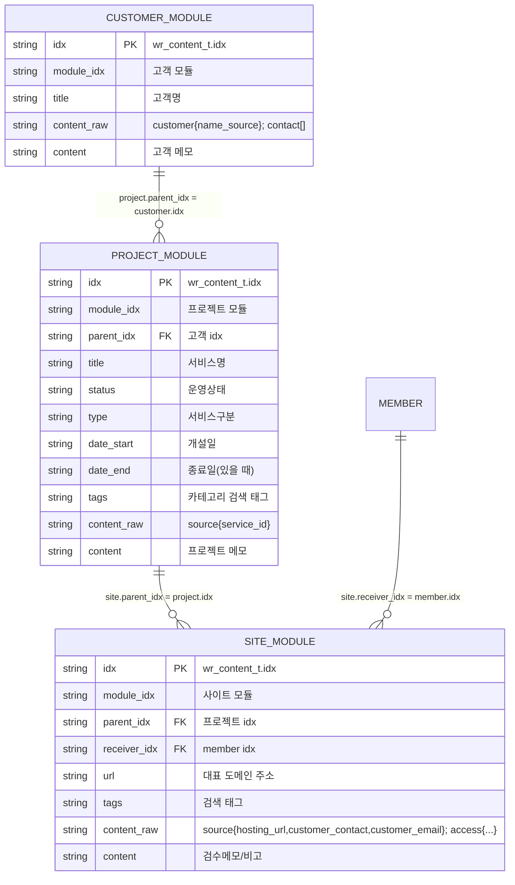

# `wr_content_t` 3모듈 ERD와 필드 구조

## 물리 구조와 논리 모듈

물리 테이블은 `wr_content_t` 하나입니다. 고객·프로젝트·사이트는 ERD 이해를 위한 논리 별칭이며 별도 테이블이 아닙니다.



## `content_raw` 사용 기준

`content_raw`는 공용 API에 JSON 문자열로 보냅니다. 일반 필드와 같은 의미의 키를 넣지 않습니다.

| 모듈 | `content_raw`에 보존하는 값 | 일반 필드에 저장하는 값 |
|---|---|---|
| 고객 | 고객명 근거, 담당자 연락처 배열 | `title`, `content` |
| 프로젝트 | 원본 서비스ID | `parent_idx`, `title`, `status`, `type`, `date_start`, `date_end`, `tags`, `content` |
| 사이트 | 호스팅주소, 고객 연락처/이메일, 접속·DB 정보 | `parent_idx`, `receiver_idx`, `url`, `tags`, `content` |

### 고객 모듈 예시

```json
{
  "customer": {"name_source": "고객명 매핑 기준"},
  "contact": [
    {"type": "phone", "name": "담당자명", "contact": "+821****0000"},
    {"type": "email", "name": "담당자명", "contact": "manager@example.com"}
  ]
}
```

### 프로젝트 모듈 예시

```json
{"source": {"service_id": "SVC-201"}}
```

프로젝트 행의 `title`, `status`, `type`, `date_start`, `date_end`, `tags`는 JSON이 아닌 공용 필드에 저장합니다.

### 사이트 모듈 예시

```json
{
  "source": {
    "hosting_url": "samplechurch.iwinv.net",
    "customer_contact": "원본 고객연락처",
    "customer_email": "원본 고객이메일"
  },
  "access": {
    "hosting": {"id": "H열", "password": "I열"},
    "admin": {"id": "J열", "password": "K열"},
    "database": {"url": "L열", "id": "M열", "password": "N열"}
  }
}
```

## `wr_content_t` 공통 필드 사용

| 필드 | 고객 모듈 | 프로젝트 모듈 | 사이트 모듈 |
|---|---|---|---|
| `idx` | 고객 행 식별자 | 프로젝트 행 식별자 | 사이트 행 식별자 |
| `module_idx` | 고객 모듈 ID | 프로젝트 모듈 ID | 사이트 모듈 ID |
| `parent_idx` | — | 고객 `idx` | 프로젝트 `idx` |
| `receiver_idx` | — | — | 담당 member `idx` |
| `title` | 고객명 | 서비스/프로젝트명 | 필요 시 사이트 표시명 |
| `status` | — | 운영상태 | — |
| `type` | — | 서비스구분 | — |
| `date_start` | — | 개설일 | — |
| `date_end` | — | 종료일이 있을 때 | — |
| `url` | — | — | 대표 도메인주소 |
| `tags` | — | 카테고리 | 도메인·호스팅·프레임워크 |
| `content_raw` | 연락처·고객 원본 | 원본 서비스 식별값 | 원본 보존값·접속정보 |
| `content` | 고객 메모 | 프로젝트 메모 | 검수메모·비고 |

## 한 서비스 행의 최종 행 나열 예시

| 논리 모듈 | `idx` | `parent_idx` | 일반 필드 | `content_raw` |
|---|---|---|---|---|
| 고객 | `customer-uuid-001` | — | `title=샘플교회` | `customer`, `contact[]` |
| 프로젝트 | `project-uuid-001` | `customer-uuid-001` | `title`, `status`, `type`, `date_start`, `tags` | `source.service_id` |
| 사이트 | `site-uuid-001` | `project-uuid-001` | `url`, `receiver_idx`, `tags`, `content` | `source`, `access` |

## 적재 순서

1. 고객 모듈 행을 만들고 고객 `idx`를 받습니다.
2. 프로젝트 모듈 행을 만들며 `parent_idx`에 고객 `idx`를 넣습니다.
3. 사이트 모듈 행을 만들며 `parent_idx`에 프로젝트 `idx`를 넣습니다.
4. 각 행의 `content_raw`가 유효한 JSON 문자열이며 공용 필드값을 중복하지 않는지 확인합니다.
5. 목록 조회에서 세 행의 `module_idx`와 `parent_idx`를 대조합니다.
