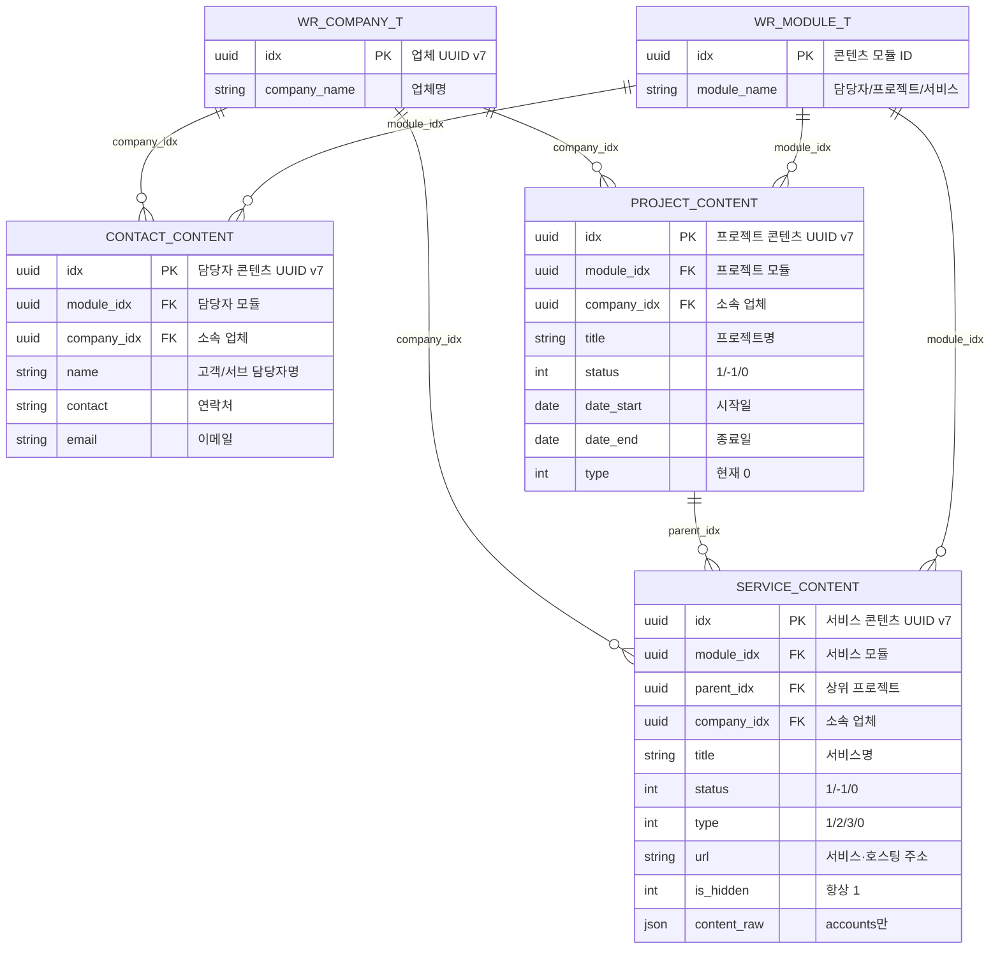

# 우리기획 업체·담당자·프로젝트·서비스 ERD

> **현재 구조**: 업체는 `wr_company_t`에 저장하고, 담당자·프로젝트·서비스는 서로 다른 `module_idx`를 가진 `wr_content_t` 콘텐츠 행으로 저장한다.
>
> 이전의 “고객 콘텐츠 → 프로젝트 → 서비스” ERD는 현재 구조와 다르다. 고객/서브 담당자는 별도 **담당자 모듈** 콘텐츠이며, 업체의 기준 레코드는 `wr_company_t`다.

## ERD


```mermaid
erDiagram
    WR_COMPANY_T ||--o{ CONTACT_CONTENT : "company_idx"
    WR_COMPANY_T ||--o{ PROJECT_CONTENT : "company_idx"
    WR_COMPANY_T ||--o{ SERVICE_CONTENT : "company_idx"
    PROJECT_CONTENT ||--o{ SERVICE_CONTENT : "parent_idx"
    WR_MODULE_T ||--o{ CONTACT_CONTENT : "module_idx"
    WR_MODULE_T ||--o{ PROJECT_CONTENT : "module_idx"
    WR_MODULE_T ||--o{ SERVICE_CONTENT : "module_idx"

    WR_COMPANY_T {
        uuid idx PK "업체 UUID v7"
        string company_name "업체명"
    }

    WR_MODULE_T {
        uuid idx PK "콘텐츠 모듈 ID"
        string module_name "담당자/프로젝트/서비스"
    }

    CONTACT_CONTENT {
        uuid idx PK "담당자 콘텐츠 UUID v7"
        uuid module_idx FK "담당자 모듈"
        uuid company_idx FK "소속 업체"
        string name "고객/서브 담당자명"
        string contact "연락처"
        string email "이메일"
    }

    PROJECT_CONTENT {
        uuid idx PK "프로젝트 콘텐츠 UUID v7"
        uuid module_idx FK "프로젝트 모듈"
        uuid company_idx FK "소속 업체"
        string title "프로젝트명"
        int status "1/-1/0"
        date date_start "시작일"
        date date_end "종료일"
        int type "현재 0"
    }

    SERVICE_CONTENT {
        uuid idx PK "서비스 콘텐츠 UUID v7"
        uuid module_idx FK "서비스 모듈"
        uuid parent_idx FK "상위 프로젝트"
        uuid company_idx FK "소속 업체"
        string title "서비스명"
        int status "1/-1/0"
        int type "1/2/3/0"
        string url "서비스·호스팅 주소"
        int is_hidden "항상 1"
        json content_raw "accounts만"
    }
```

## 관계 설명

| 관계 | 실제 연결 필드 | 설명 |
|---|---|---|
| 업체 → 담당자 | `contact.company_idx → company.idx` | 외부 고객/서브 담당자는 업체에 속한다. |
| 업체 → 프로젝트 | `project.company_idx → company.idx` | 프로젝트는 업체에 속한다. |
| 업체 → 서비스 | `service.company_idx → company.idx` | 서비스는 업체에 직접 귀속된다. |
| 프로젝트 → 서비스 | `service.parent_idx → project.idx` | 서비스의 상위 프로젝트를 나타낸다. 업체 관계를 대신하지 않는다. |
| 모듈 → 콘텐츠 | `content.module_idx → module.idx` | 동일 `wr_content_t` 행을 담당자·프로젝트·서비스로 구분한다. |

```text
company.idx
 ├─ contact.company_idx
 ├─ project.company_idx
 └─ service.company_idx

project.idx
 └─ service.parent_idx
```

## 고정 모듈 ID

| 콘텐츠 | `module_idx` | 역할 |
|---|---|---|
| 담당자 | `01a05700-8c1d-7cd4-8b2d-fac77f865a9f` | 고객·서브 담당자 연락처 |
| 프로젝트 | `01a05701-ed99-7cfa-841e-ec6f6c9922a0` | 업체 프로젝트 |
| 서비스 | `01a05702-067e-729b-85ab-deb5b0836082` | 운영·테스트·샘플 서비스 |

## 콘텐츠별 데이터 보관 위치

| 데이터 | 저장 위치 | 이유 |
|---|---|---|
| 업체명 | `wr_company_t.company_name` | 업체 기준 정보 |
| 고객/서브 담당자 | 담당자 콘텐츠의 `name`, `contact`, `email` | 내부 담당자 필드와 분리 |
| 프로젝트 상태·기간 | 프로젝트 콘텐츠의 `status`, `date_start`, `date_end` | 검색·필터 가능한 일반 필드 |
| 서비스 상태·기간·유형 | 서비스 콘텐츠의 `status`, `date_start`, `date_end`, `type` | 검색·필터 가능한 일반 필드 |
| 서비스/호스팅 주소 | 서비스 콘텐츠의 `url` | 원본 서비스·호스팅 주소만 쉼표로 보존 |
| 접속·DB·관리자 계정 | 서비스 콘텐츠의 `content_raw.accounts` | 민감정보이므로 `is_hidden=1` |

## 상태 및 유형 코드

| 필드 | 코드 | 의미 |
|---|---:|---|
| 프로젝트/서비스 `status` | `1` | 운영 |
| 프로젝트/서비스 `status` | `-1` | 비운영 또는 종료 |
| 프로젝트/서비스 `status` | `0` | 원본 값 없음 또는 `unknown` |
| 프로젝트 `type` | `0` | 현재 원본에 프로젝트 유형이 없음 |
| 서비스 `type` | `1` | 실제 운영 |
| 서비스 `type` | `2` | 테스트/개발 |
| 서비스 `type` | `3` | 샘플 |
| 서비스 `type` | `0` | 원본 값 없음 또는 `unknown` |

## 서비스 `content_raw` 제한

`content_raw`는 계정 정보만 보관한다. 최상위 키는 `accounts` 하나뿐이다.

```json
{
  "accounts": [
    {"type": "FTP", "id": "<원본 FTP ID>", "pw": "<원본 FTP PW>"},
    {"type": "DB_iwinv", "url": "<원본 DB URL>", "id": "<원본 DB ID>", "pw": "<원본 DB PW>"},
    {"type": "admin", "id": "<원본 관리자 ID>", "pw": "<원본 관리자 PW>"}
  ]
}
```

| JSON 경로 | 허용값/설명 |
|---|---|
| `accounts[].type` | `FTP`, `DB_iwinv`, `DB`, `admin` 중 하나 |
| `accounts[].id` | 원본 계정 ID가 있을 때만 |
| `accounts[].pw` | 원본 비밀번호가 있을 때만 |
| `accounts[].url` | phpMyAdmin 등 원본 DB 관리 URL이 있을 때만 |

`urls`, `access_check`, `status`, `type`, `risk_flags`, 메모 등은 `content_raw`에 넣지 않는다.

## 적재 순서

1. `company.csv`로 업체를 만든다.
2. `contact_module.csv`와 `project_module.csv`를 `company_idx` 참조가 유효한 상태에서 적재한다.
3. `service_module.csv`를 적재한다. 이때 `company_idx`와 `parent_idx`가 모두 존재해야 한다.
4. 모든 서비스의 `is_hidden=1`과 `content_raw.accounts` JSON 규칙을 검증한다.

필드별 CSV 제약과 예시는 [이관 CSV 필드 명세](wr-import-field-spec.md)를 참조한다.
